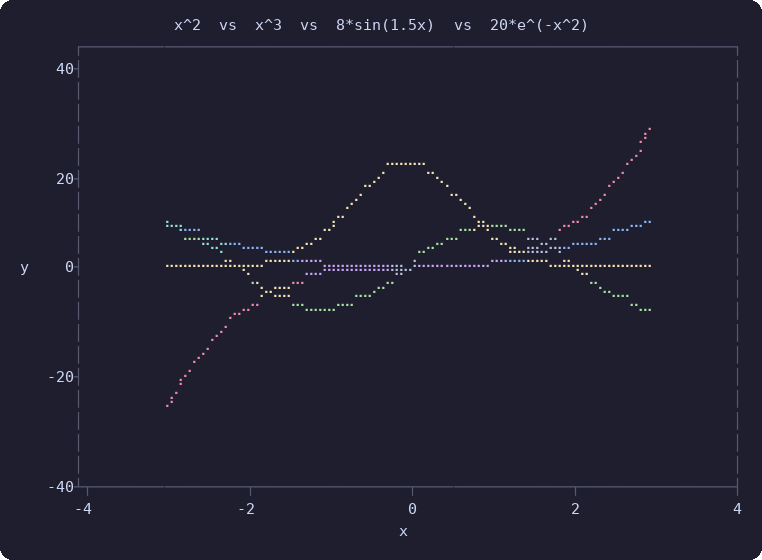

# ploot

A terminal plotting library for Rust that renders charts using Unicode Braille characters (U+2800-U+28FF).

Each terminal cell encodes a 2x4 sub-pixel grid, giving smooth curves at high effective resolution without leaving the terminal.



## Usage

Add `ploot` to your `Cargo.toml`:

```toml
[dependencies]
ploot = "0.1"
```

Plot a single series:

```rust
let xs: Vec<f64> = (0..=100).map(|i| i as f64 / 10.0).collect();
let ys: Vec<f64> = xs.iter().map(|&x| x.sin()).collect();

let plot = ploot::quick_plot(&xs, &ys, Some("sin(x)"), Some("x"), Some("y"), 80, 24);
println!("{plot}");
```

Plot multiple series with automatic color cycling:

```rust
let xs: Vec<f64> = (-30..=30).map(|i| i as f64 / 10.0).collect();
let quadratic: Vec<f64> = xs.iter().map(|&x| x * x).collect();
let cubic: Vec<f64> = xs.iter().map(|&x| x * x * x).collect();
let sine: Vec<f64> = xs.iter().map(|&x| 8.0 * (x * 1.5).sin()).collect();
let gaussian: Vec<f64> = xs.iter().map(|&x| 20.0 * (-x * x).exp()).collect();

let plot = ploot::quick_plot_multi(
    &[(&xs, &quadratic), (&xs, &cubic), (&xs, &sine), (&xs, &gaussian)],
    Some("x^2  vs  x^3  vs  8*sin(1.5x)  vs  20*e^(-x^2)"),
    Some("x"),
    Some("y"),
    80,
    24,
);
println!("{plot}");
```

## Features

- **Braille rendering** - 2x4 sub-pixel resolution per terminal cell via bitwise dot compositing
- **ANSI color** - automatic 7-color palette cycling across series (blue, red, green, yellow, cyan, magenta, white), with additive color mixing when curves overlap
- **Axis layout** - auto-generated tick marks using Heckbert's nice numbers algorithm, dynamic label width computation, configurable title and axis labels
- **Line drawing** - Bresenham's algorithm with dash pattern support (solid, dash, dot, dot-dash, etc.)
- **Viewport clipping** - Cohen-Sutherland algorithm clips lines to the canvas bounds
- **Zero dependencies** - pure Rust, no external crates

## Architecture

```
API (quick_plot, quick_plot_multi)
 └─ Layout (space allocation, tick generation, frame rendering)
     └─ Transform (data → normalized → pixel coordinate mapping, clipping)
         └─ Canvas (BrailleCanvas, Bresenham lines, color compositing)
```

## License

Apache-2.0
