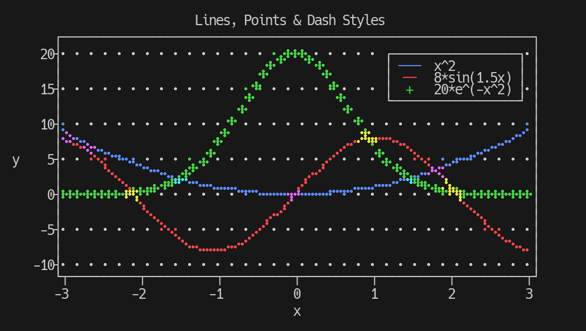
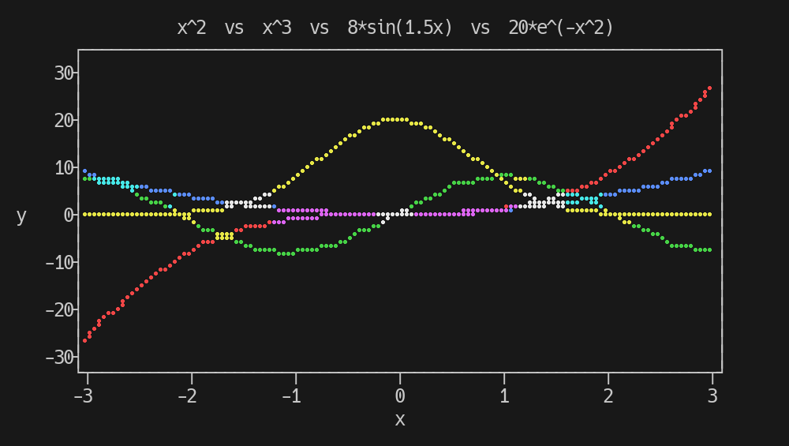
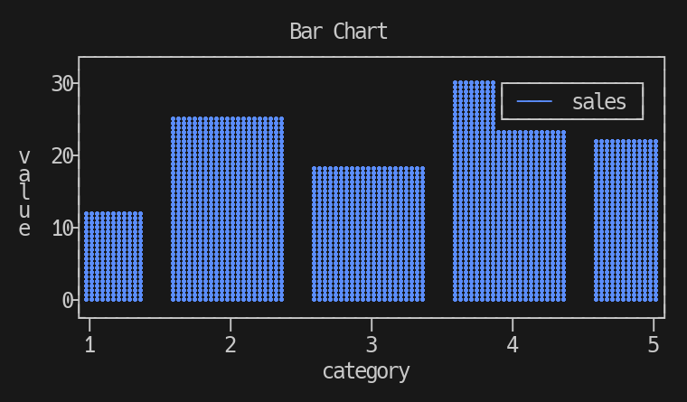
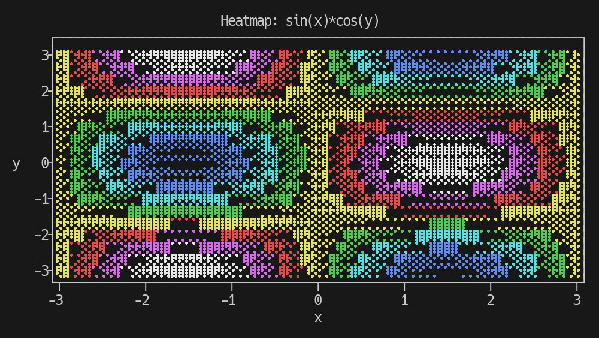
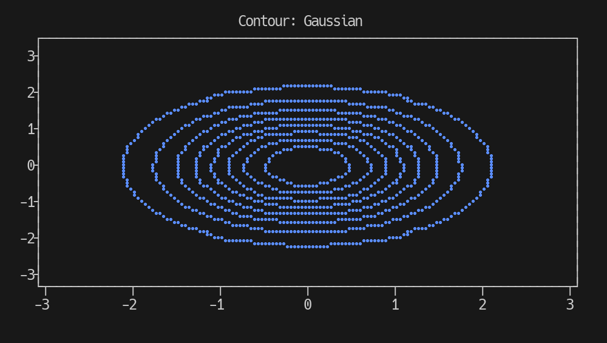
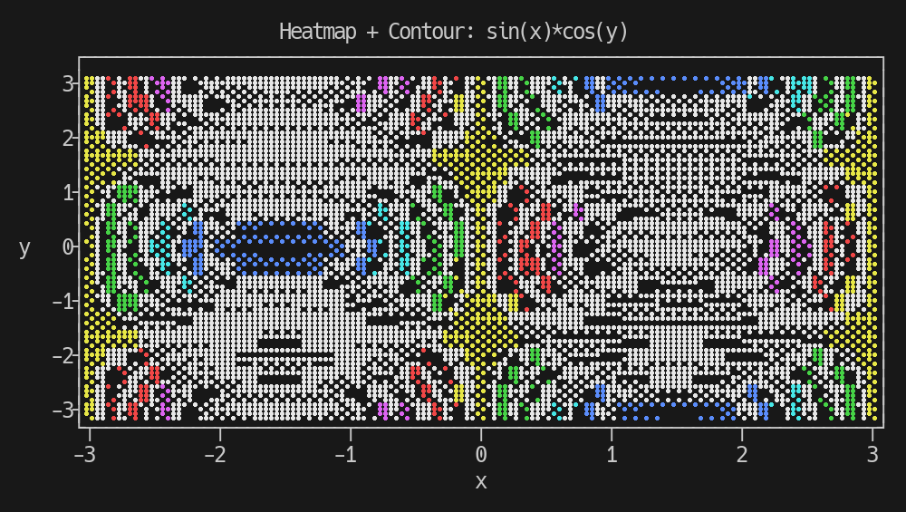
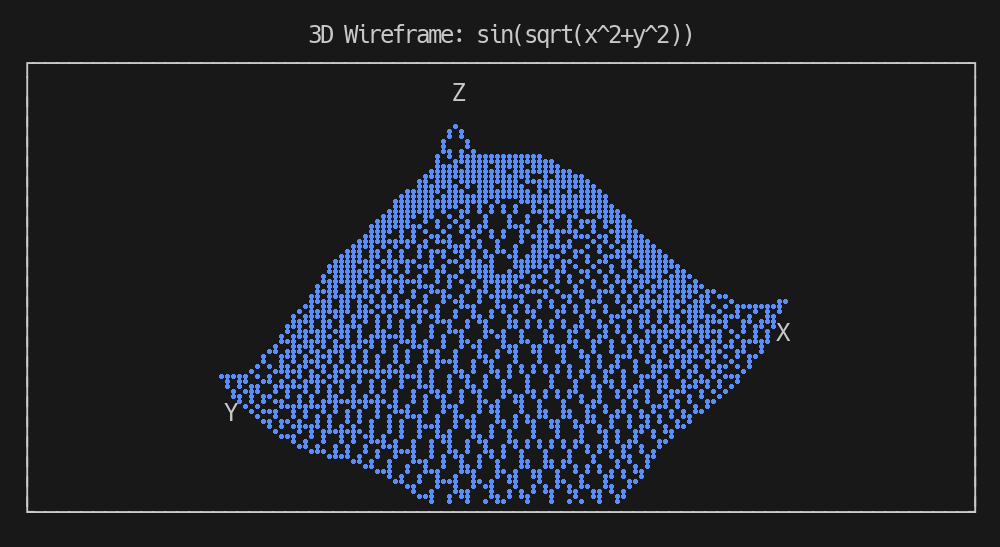
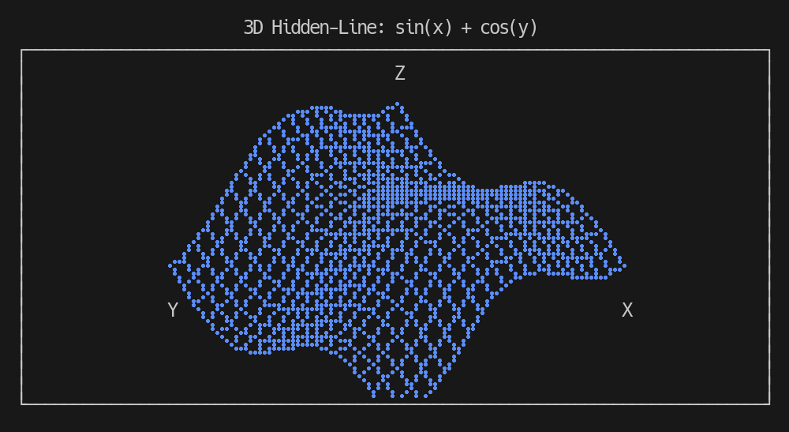
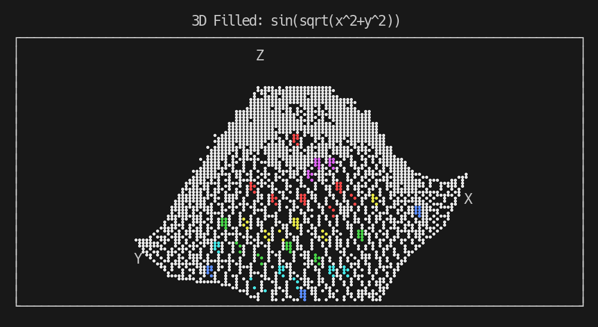

# ploot

### Note: This is almost entirely machine generated code. It works for my applications but comes with absolutely no guarantees regarding API stability or anything else. Use at your own risk.

A terminal plotting library for Rust that renders charts using Unicode Braille characters (U+2800-U+28FF).

Each terminal cell encodes a 2x4 sub-pixel grid, giving smooth curves at high effective resolution without leaving the terminal. Zero dependencies, pure Rust.

## Gallery

### Line plots with legend, grid, and dash styles



### Multiple series with automatic color cycling



### Bar chart



### Heatmap

Color-mapped density rendering of 2D scalar fields using Braille dot density + ANSI color.



### Contour plot

Isolines extracted via marching squares, drawn as Braille curves.



### Heatmap + contour overlay



### 3D wireframe surface



### 3D hidden-line surface

Depth-buffered wireframe with per-pixel occlusion.



### 3D filled surface

Color-mapped density shading with wireframe overlay.



## Usage

Add `ploot` to your `Cargo.toml`:

```toml
[dependencies]
ploot = "0.1.2"
```

### Figure / Axes2D builder API

```rust
use ploot::{Figure, PlotOption, DashType, PointSymbol};

let mut fig = Figure::new();
fig.set_terminal_size(80, 24);
{
    let ax = fig.axes2d();
    ax.set_title("Builder API Demo");
    ax.set_x_label("x", &[]);
    ax.set_y_label("y", &[]);
    ax.set_y_grid(true);

    let xs: Vec<f64> = (-30..=30).map(|i| i as f64 / 10.0).collect();
    let quadratic: Vec<f64> = xs.iter().map(|&x| x * x).collect();
    let sine: Vec<f64> = xs.iter().map(|&x| 8.0 * (x * 1.5).sin()).collect();

    ax.lines(
        xs.iter().copied(),
        quadratic.iter().copied(),
        &[PlotOption::Caption("x^2".into()), PlotOption::LineStyle(DashType::Solid)],
    );
    ax.lines(
        xs.iter().copied(),
        sine.iter().copied(),
        &[PlotOption::Caption("8*sin(1.5x)".into()), PlotOption::LineStyle(DashType::Dash)],
    );
}
fig.show();
```

### Quick one-shot API

For simple plots without the full builder:

```rust
let xs: Vec<f64> = (0..=100).map(|i| i as f64 / 10.0).collect();
let ys: Vec<f64> = xs.iter().map(|&x| x.sin()).collect();

let plot = ploot::quick_plot(&xs, &ys, Some("sin(x)"), Some("x"), Some("y"), 80, 24);
println!("{plot}");
```

### Heatmap

```rust
use ploot::GridData;

let grid = GridData::from_fn(
    |x, y| x.sin() * y.cos(),
    (-std::f64::consts::PI, std::f64::consts::PI),
    (-std::f64::consts::PI, std::f64::consts::PI),
    40, 40,
);
let output = ploot::quick_heatmap(grid, Some("sin(x)*cos(y)"), Some("x"), Some("y"), 80, 24);
println!("{output}");
```

### Contour

```rust
use ploot::GridData;

let grid = GridData::from_fn(
    |x, y| (-0.5 * (x * x + y * y)).exp(),
    (-3.0, 3.0), (-3.0, 3.0), 40, 40,
);
let output = ploot::quick_contour(grid, 8, Some("Gaussian"), 80, 24);
println!("{output}");
```

### Heatmap + contour overlay

```rust
use ploot::{Figure, GridData, PlotOption};

let grid = GridData::from_fn(
    |x, y| x.sin() * y.cos(),
    (-std::f64::consts::PI, std::f64::consts::PI),
    (-std::f64::consts::PI, std::f64::consts::PI),
    40, 40,
);
let mut fig = Figure::new();
fig.set_terminal_size(80, 24);
{
    let ax = fig.axes2d();
    ax.set_title("Heatmap + Contour");
    ax.heatmap_contour(grid, None, &[PlotOption::ContourLevels(10)]);
}
fig.show();
```

### 3D surface

```rust
use ploot::{ColorMapType, Figure, GridData, SurfaceStyle};

let grid = GridData::from_fn(
    |x, y| (x * x + y * y).sqrt().sin(),
    (-4.0, 4.0), (-4.0, 4.0), 20, 20,
);
let mut fig = Figure::new();
fig.set_terminal_size(80, 24);
{
    let ax = fig.axes3d();
    ax.set_title("3D Surface");
    ax.set_view(30.0, 30.0);
    ax.set_colormap(ColorMapType::Rainbow);
    ax.surface(grid, SurfaceStyle::Filled, &[]);
}
fig.show();
```

Other surface styles: `SurfaceStyle::Wireframe`, `SurfaceStyle::HiddenLine`.

## Features

### 2D plots
- **Line plots** - solid, dashed, dotted, and custom dash patterns
- **Scatter plots** - six marker styles: dot, cross, circle, diamond, triangle, square
- **Bar charts** - filled boxes with configurable width
- **Fill-between** - shaded area between two curves
- **Error bars** - X and Y error bars, with or without connecting lines
- **Box-and-whisker** - statistical summary plots

### 2D grid data
- **Heatmap** - color-mapped density rendering of Z(x,y) scalar fields using Braille dot density + ANSI color (7 colors x 8 density levels = 56 perceptual levels)
- **Contour** - isolines via marching squares with linear interpolation and saddle-point disambiguation
- **Heatmap + contour overlay** - combined density shading with isoline overlay

### 3D surfaces
- **Wireframe** - projected mesh lines from configurable azimuth/elevation viewpoint
- **Hidden-line** - depth-buffered wireframe with per-pixel z-test occlusion
- **Filled** - color-mapped density shading per quad with wireframe overlay
- **Colormaps** - Heat, Gray, Rainbow, BlueRed

### Rendering
- **Braille rendering** - 2x4 sub-pixel resolution per terminal cell via bitwise dot compositing
- **ANSI color** - automatic 7-color palette cycling (blue, red, green, yellow, cyan, magenta, white), with additive color mixing when curves overlap
- **Line drawing** - Bresenham's algorithm with dash pattern support
- **Viewport clipping** - Cohen-Sutherland algorithm clips lines to canvas bounds
- **Depth buffer** - z-buffer for correct 3D occlusion (front-to-back rendering)

### Layout and axes
- **Axis layout** - auto-generated tick marks using Heckbert's nice numbers algorithm
- **Secondary axes** - independent x2/y2 axes with separate ranges, labels, and tick marks
- **Logarithmic scaling** - per-axis log-scale support with any base
- **Grid lines** - major and minor grid with configurable color and dash patterns
- **Legend** - automatic legend with 4-corner placement control
- **Annotations** - text labels and arrows in data or graph coordinates
- **Custom ticks** - user-defined tick positions and labels
- **Axis reversal** - flip axis direction
- **Multiplot** - subplot grid layout with shared super-title (2D and 3D can be mixed)

### Data handling
- **LTTB downsampling** - automatic downsampling for large datasets
- **GridData** - 2D matrix with `from_fn` (sample a function) and `from_rows` (nested iterators) constructors, bilinear interpolation
- **Terminal size detection** - auto-detect terminal dimensions via ioctl/env fallback
- **Zero dependencies** - pure Rust, no external crates

## Architecture

```
API (Figure, Axes2D, Axes3D, GridData, options, series data)
 |
 +-- Render
 |    +-- 2D: lines, points, boxes, fill, error_bars, box_whisker, heatmap, contour
 |    +-- 3D: surface (wireframe, hidden-line, filled)
 |    +-- Overlays: grid, legend, annotations
 |
 +-- Layout (space allocation, tick generation, frame rendering)
 |
 +-- Transform
 |    +-- CoordinateMapper (data -> pixel), clipping, downsampling
 |    +-- Projection (3D -> 2D rotation), marching squares
 |
 +-- Canvas
      +-- BrailleCanvas (Bresenham lines, dash patterns, color compositing)
      +-- DepthCanvas (z-buffer wrapper for 3D occlusion)
      +-- ColorMap (value -> color + density mapping)
```

## Examples

Run any example from the `examples/` directory:

```bash
cargo run --example line_plot
cargo run --example bar_chart
cargo run --example heatmap
cargo run --example contour
cargo run --example heatmap_contour
cargo run --example surface_wireframe
cargo run --example surface_hidden
cargo run --example surface_filled
```

## License

Apache-2.0
